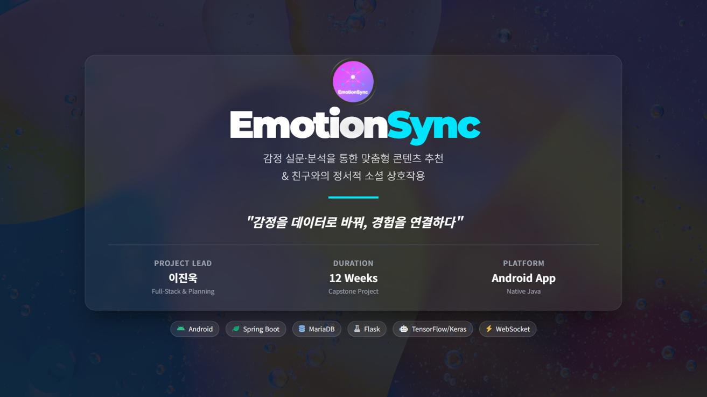
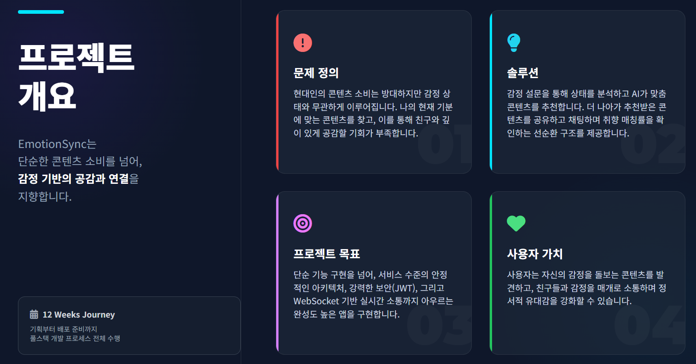
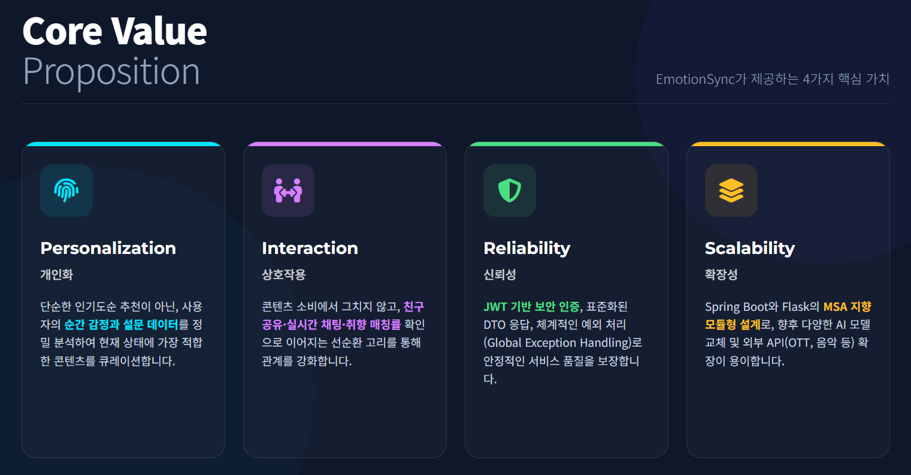
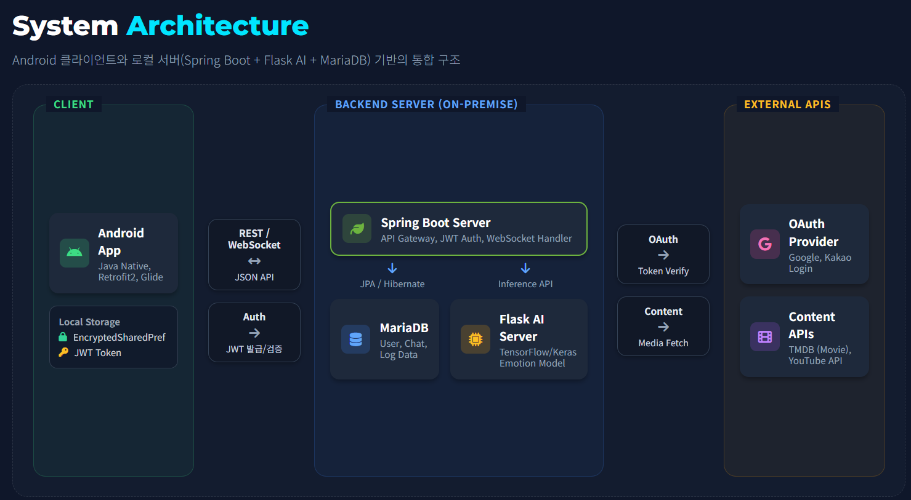
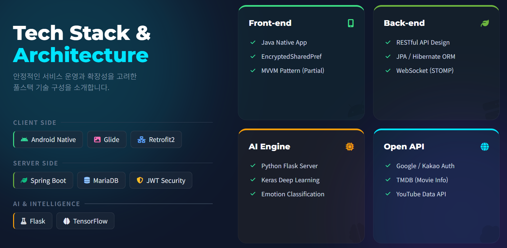
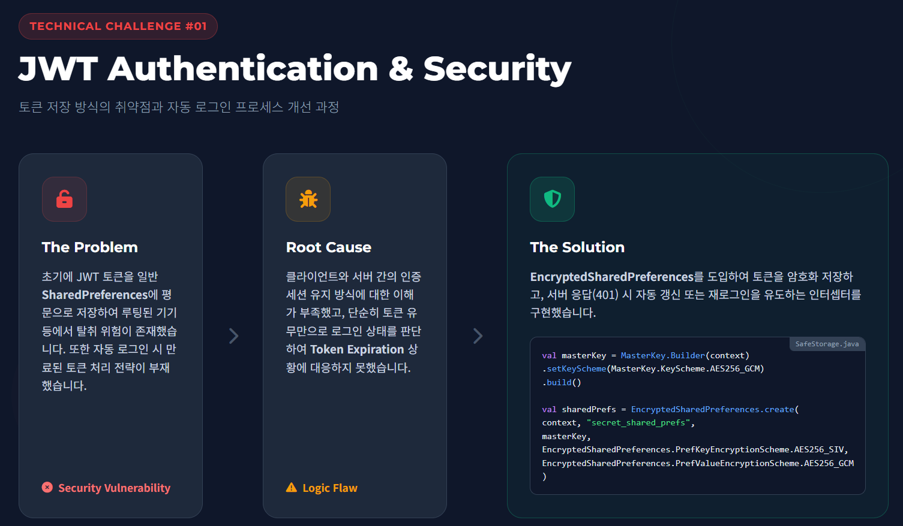
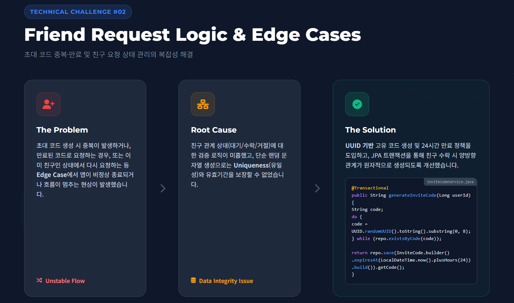
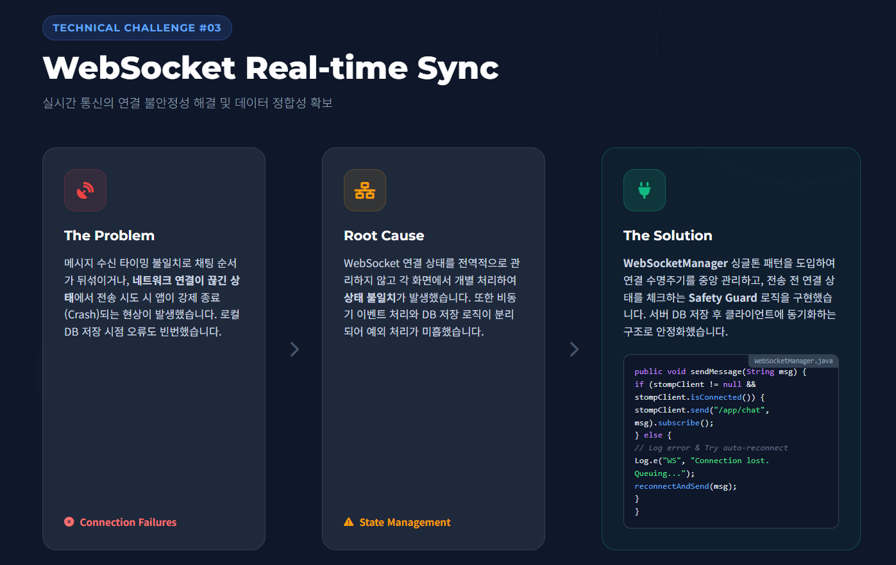
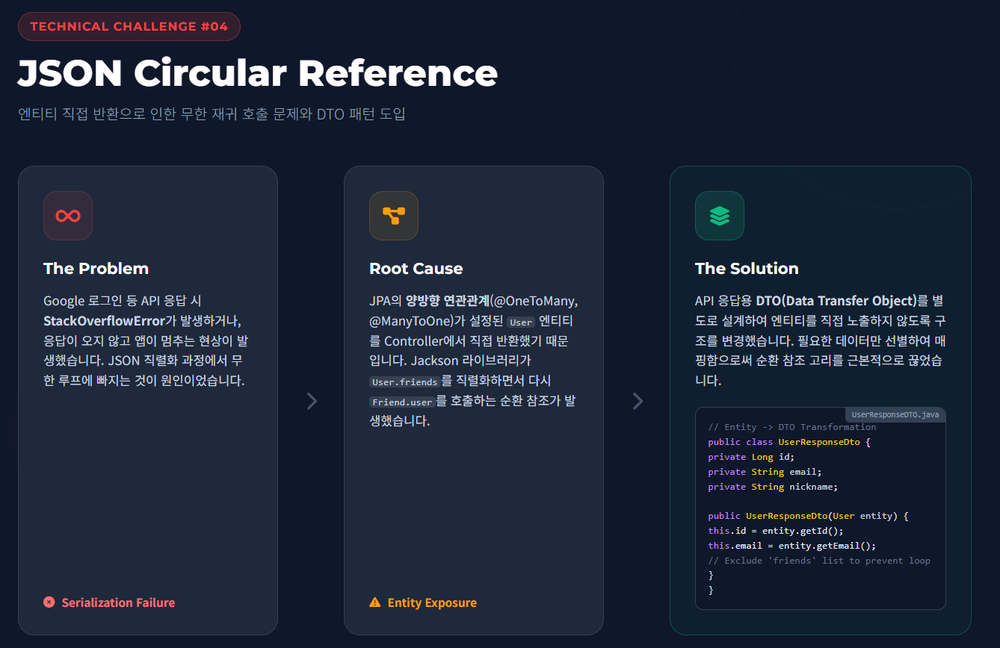

<p align="center">
  
</p>

# EmotionSync (CapStone)
**"감정을 데이터로 바꿔, 경험을 연결하다"**

EmotionSync는 사용자의 감정/설문 데이터를 분석해 **맞춤형 콘텐츠를 추천**하고,
친구와 **공유·채팅·취향 매칭**으로 이어지는 감정 기반 소셜 추천 플랫폼입니다.
Android 앱, Spring Boot 백엔드, Python(Flask) 추천 서비스로 구성된 **3인 팀 프로젝트**입니다.

---

## Quick Facts
| 기간 | 팀 규모 | 역할 | 플랫폼 |
| --- | --- | --- | --- |
| 12 weeks | 3명 | 리더 / 풀스택 (기여도 약 70%) | Android (Java) |

---

## 프로젝트 개요
- **문제 정의**: 감정 상태와 무관한 콘텐츠 소비가 대부분이며, 공감/소통으로 이어지는 경험이 부족함
- **솔루션**: 감정 설문 → AI 감정 분류 → 콘텐츠 추천 → 공유/채팅/매칭의 선순환 구조
- **프로젝트 목표**: 서비스 수준의 안정적 아키텍처, 강력한 보안(JWT), 실시간 소통(WebSocket)까지 구현
- **사용자 가치**: 감정 돌봄 콘텐츠 발견 + 친구와 정서적 유대감 강화

<p align="center">
  
</p>

---

## Core Value Proposition
- **Personalization (개인화)**: 순간 감정과 설문 데이터를 정밀 분석해 최적의 콘텐츠를 큐레이션
- **Interaction (상호작용)**: 추천 → 공유 → 채팅 → 매칭률로 이어지는 관계 강화 경험
- **Reliability (신뢰성)**: JWT 기반 인증, DTO 응답 체계, 예외 처리 정비로 안정적 서비스 품질 확보
- **Scalability (확장성)**: Spring Boot + Flask 모듈형 구조로 AI 모델/외부 API 확장 용이

<p align="center">
  
</p>

---

## 핵심 기능
1. **Authentication & Security**
   - Google/Kakao OAuth 2.0 연동
   - JWT 토큰 EncryptedSharedPreferences 암호화 저장
   - 토큰 유효성 검증 + 자동 로그인 로직
2. **Emotion Selection**
   - 4가지 핵심 감정(기쁨/슬픔/화남/불안) 직관적 선택
   - 5문항 심층 설문(객관식 4 + 주관식 1)
3. **Content Recommendation (AI-Driven)**
   - Flask + TensorFlow 모델로 감정 기반 카테고리 예측
   - TMDB / YouTube API 연동으로 실시간 콘텐츠 조회
   - 카드형 UI + 상세 페이지 + 바로가기/공유
4. **Friends & Invitation System**
   - UUID 기반 고유 초대코드 발급
   - 요청/수락 즉시 양방향 친구 관계 설정
   - 알림(Notification) 기반 실시간 피드백
5. **Real-time Chat & Communication**
   - WebSocket 기반 1:1 실시간 채팅
   - 재연결 감지 및 안정성 보강
   - MariaDB + Room 로컬 저장으로 대화 기록 유지
6. **Preference Matching System**
   - 좋아요(+2) / 싫어요(-1)로 취향 표현
   - 누적 점수 기반 0~100% 매칭률 산출
   - 프로필 노출로 대화 유도

---

## 시스템 아키텍처
<p align="center">
  
</p>

**흐름 요약**
- Android 앱 → Spring Boot API → Flask 추천 서비스 → TMDB/YouTube API
- JWT 인증 및 WebSocket 기반 실시간 커뮤니케이션 지원

---

## 기술 스택
**Front-end (Android / Java)**
- Retrofit / OkHttp, Gson
- Room (로컬 DB)
- EncryptedSharedPreferences (JWT 안전 저장)
- WebSocket (실시간 채팅)

**Back-end**
- Spring Boot 3.2.4, Java 21
- Spring Security, JWT
- Spring Data JPA, MariaDB

**AI / Recommendation**
- Python, Flask
- TensorFlow/Keras
- pandas, scikit-learn

**External API**
- Google/Kakao OAuth
- TMDB API, YouTube Data API

<p align="center">
  
</p>

---

## Technical Challenges & Solutions
**1) JWT Authentication & Security**
- 문제: 토큰을 일반 SharedPreferences에 평문 저장 → 탈취 위험, 만료 토큰 처리 부재
- 해결: EncryptedSharedPreferences 도입 + 401 응답 시 재로그인 유도 로직 구현

<p align="center">
  
</p>

**2) Friend Request Logic & Edge Cases**
- 문제: 초대 코드 중복/만료/중복 요청 등 엣지 케이스 처리 미흡
- 해결: UUID 고유 코드 + 24시간 만료 정책 + JPA 트랜잭션 기반 양방향 관계 보장

<p align="center">
  
</p>

**3) WebSocket Real-time Sync**
- 문제: 연결 불안정 시 메시지 순서 꼬임, 전송 오류로 앱 크래시
- 해결: WebSocketManager 싱글톤 + 연결 상태 Safety Guard + 서버 저장 후 동기화

<p align="center">
  
</p>

**4) JSON Circular Reference**
- 문제: 엔티티 직접 반환 시 순환 참조 발생으로 StackOverflowError
- 해결: DTO 패턴 도입으로 필요한 데이터만 매핑

<p align="center">
  
</p>

---

## 내 역할 (팀 리더 / 기여도 약 70%)
- **기획·설계 리딩**: 문제 정의, 요구사항, 사용자 흐름 설계
- **아키텍처 설계**: Android ↔ Spring ↔ Flask 연동 구조 설계
- **백엔드 개발 대부분 담당**
  - 회원/인증/JWT, 친구/공유/매칭/알림 API 설계 및 구현
  - DB 모델링 및 비즈니스 로직 구현
- **모바일 앱 개발 대부분 담당**
  - 주요 화면/UX 구현
  - 추천/공유/친구/알림 기능 연동
- **협업 파트(팀원 담당)**
  - AI 모델 학습 파이프라인
  - WebSocket 기반 채팅 핵심 구현
  - Flask–Spring 연동부

---

## Retrospective & Insights
> "전체 흐름과 데이터 연계를 끝까지 책임지며, 핵심 기능을 직접 완성했습니다."

- **Leadership**: 일정 관리 및 주요 의사결정 주도, QA까지 책임
- **Collaboration**: 역할 명확화와 지속적인 코드 리뷰로 협업 리듬 유지
- **Technical Growth**: JWT 보안, WebSocket 실시간 통신, 아키텍처 설계 역량 강화

---

## 프로젝트 구조
```
CapStoneRepo/
├─ EmotionSyncServer/        # Spring Boot 백엔드 + Python 추천 서비스
│  ├─ src/main/java/...       # API, 인증, 도메인 로직
│  ├─ app.py                  # Flask 추천 API
│  ├─ recommend_service.py    # 추천 로직
│  ├─ create_model_files.py   # 모델 학습 스크립트
│  └─ emotion_dataset.csv     # 감정 데이터셋
└─ capstone/                  # Android 앱
   └─ app/src/main/...        # 주요 UI 및 기능 구현
```

---

## 실행 방법 (요약)
1) **환경 변수 설정**
   - `EmotionSyncServer/.env.example` → `.env`
   - `EmotionSyncServer/src/main/resources/application.properties`
2) **Spring Boot 실행**
3) **Flask 추천 서비스 실행** (`app.py`)
4) **Android 앱 실행**

> 민감 정보(API Key/DB 계정 등)는 저장소에 포함되지 않습니다.

---

## 한 줄 요약
**감정 데이터를 기반으로 추천과 소셜 커뮤니케이션을 결합한 AI 기반 모바일 서비스**
